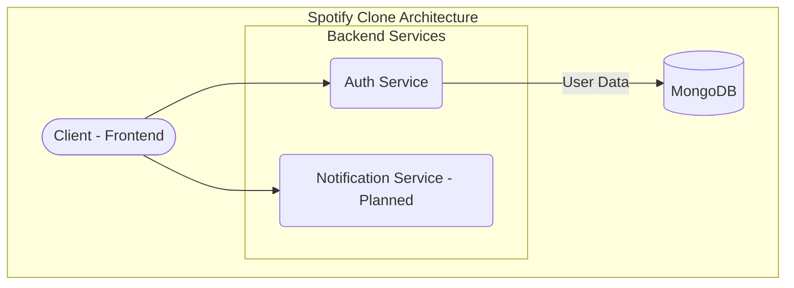

<div align="center">
  <h1 align="center">Spotify Clone - Full Stack with Microservices</h1>
  <p align="center">
    A full-stack Spotify clone project built with a microservices architecture, aiming to replicate the core functionalities of Spotify.
  </p>
</div>

<div align="center">

[](https://github.com/chittaranjan24/FSD_SPOTIFY_CLONE/issues)
[](https://github.com/chittaranjan24/FSD_SPOTIFY_CLONE/network/members)
[](https://github.com/chittaranjan24/FSD_SPOTIFY_CLONE/stargazers)
[](https://choosealicense.com/licenses/mit/)

</div>

## ✨ Features

- **User Authentication:** Secure user registration and login using JWT.
- **Microservices Architecture:** The backend is split into multiple services for better scalability and maintainability.
- **Music Player:** (Planned) A fully functional music player to stream tracks.
- **Playlist Management:** (Planned) Create, edit, and delete playlists.
- **Search:** (Planned) Search for tracks, artists, and albums.

## 🏗️ Architecture

The application is designed using a microservices architecture. Each service is responsible for a specific business domain.



- **`server/auth`:** Handles user authentication and authorization.
- **`server/notification`:** (Planned) Responsible for sending notifications to users.
- **`client`:** The frontend of the application.

## 🛠️ Technologies Used

### Backend
<p>
  
  
  
  
</p>

### Frontend (Planned)
<p>
  
  
  
</p>

## 🚀 Setup and Installation

To get the project up and running on your local machine, follow these steps:

1. **Clone the repository:**
   ```bash
   git clone https://github.com/chittaranjan24/FSD_SPOTIFY_CLONE.git
   cd FSD_SPOTIFY_CLONE
   ```

2. **Setup the Auth Service:**
   ```bash
   cd server/auth
   npm install
   ```
   Create a `.env` file in the `server/auth` directory and add the following environment variables:
   ```
   PORT=8081
   MONGO_URI=your_mongodb_connection_string
   JWT_SECRET=your_jwt_secret
   ```
   Start the auth service:
   ```bash
   npm run dev
   ```

3. **Setup the Notification Service:**
   (Instructions to be added once the service is developed)

4. **Setup the Client:**
   (Instructions to be added once the client is developed)
   ```bash
   cd client
   npm install
   npm start
   ```

## Usage

Once all the services are running, you can access the application by navigating to `http://localhost:3000` (or the port your client is running on) in your web browser.

## 🤝 Contributing

Contributions are welcome! Please feel free to submit a pull request.

1. Fork the Project
2. Create your Feature Branch (`git checkout -b feature/AmazingFeature`)
3. Commit your Changes (`git commit -m 'Add some AmazingFeature'`)
4. Push to the Branch (`git push origin feature/AmazingFeature`)
5. Open a Pull Request

## 📄 License

This project is licensed under the MIT License. See the `LICENSE` file for details.